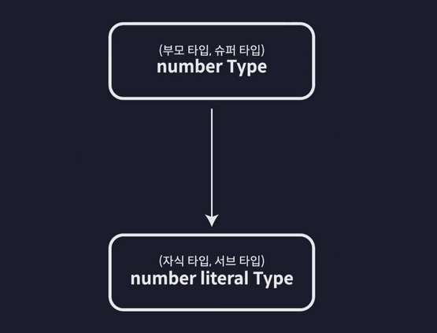
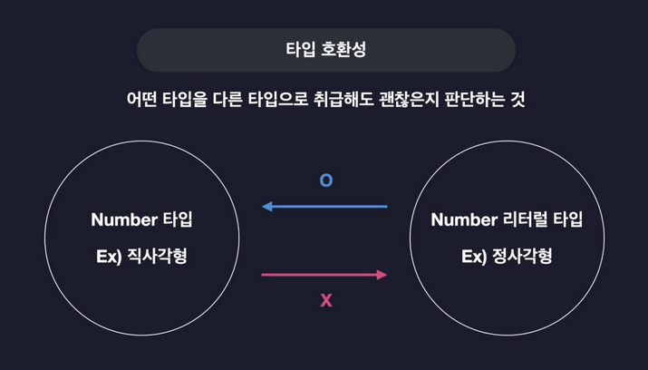
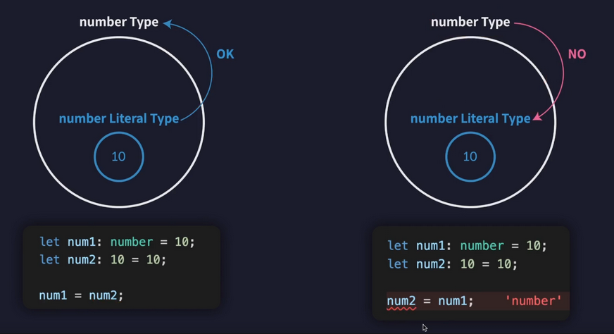
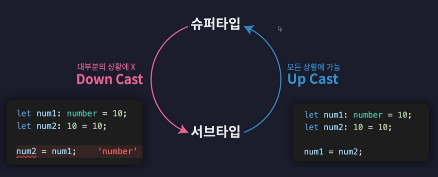

### 타입스크립트 설치

```bash
npm init
npm i @types/node

npm i -g tsx

tsc --init // tsconfig.json 초기 생성

# src/index.ts 파일에 콘솔 출력 테스트
# 터미널에서 아래 명령어를 실행하면 노드 환경에서 ts 파일을 실행하여 자바스크립트를 실행할 수 있음
tsx src/index.ts
```

<br>

---

### 다차원 배열

```tsx
let doubleArr: (number | boolean)[][] = [
  [1, 2],
  [4, false],
];
```

<br>

---

### 튜플

- 길이와 타입이 고정된 배열

```tsx
let tupple1: [number, number] = [1, 2];
let tupple2: [string, boolean, number] = ['hello', false, 7];

const users: [string, number][] = [
  ['김아무개', 1],
  ['이아무개', 2],
  ['최아무개', 3],
];
```

<br>

---

### 객체

- 구조를 기반으로 타입을 정한다고 하여 구조적 타입 시스템이라고 한다.

```tsx
// 객체 리터럴 타입
let user: {
  id: number;
  name: string;
  opt?: true;
  readonly apiKey: string;
} = {
  id: 1,
  name: '김재희',
};

user.id;
user = {
  id: 2,
  name: '아무개',
};
```

<br>

---

### 타입별칭

- 타입을 변수처럼 사용할 수 있음

```tsx
type User = {
  id: number;
  name: string;
  birth: string;
};

const user: User = {
  id: 2,
  name: '홍길동',
  birth: '1990.04.01',
};
```

<br>

---

### 인덱스 시그니처

- 객체타입의 정의를 좀더 유연하게 도와준다.
- key: value 의 규칙을 기준으로 객체의 타입을 정의
- 객체에 동적으로 키를 추가할 수 있을 때, 해당 키의 타입과 값의 타입을 정의하는 문법

```tsx
type CountryCodes = {
  [key: string]: string;
};
let countryCodes: CountryCodes = {
  korea: 'Ko',
  unitedState: 'us',
  unitedKingdom: 'uk',
};

// ===============

type CountryNumberCodes = {
  [key: string]: number;
};
let countryNumberCodes: CountryNumberCodes = {
  korea: 410,
  unitedState: 840,
  unitedKingdom: 826,
};

// 유니언 타입을 사용한 인덱스 시그니처
type Code = {
  [key: string]: string | number;
};

// 명시적인 키 vs 인덱스 시그니처 분리
type Code2 = {
  fixedKey: string; // 명시적 키
  [key: string]: string; // 그 외 키들
};
```

<br>

---

### 열거형 타입(Enumerable Type)

- 여러가지 값들에 각각 이름을 부여하고 열거해 두고 사용하는 타입

```tsx
enum Role {
  ADMIN = 0,
  USER = 1,
  GUEST = 2,
}
// 숫자 할당을 하지 않아도 0번부터 자동으로 할당된다 !!!
// 그리고 첫 값에 10을 할당하면 차례대로 10, 11, 12.. 가 할당

enum Language {
  korea = 'ko',
  english = 'en',
}
// enum 을 활용하면 실수를 줄일 수 있다.

const user1 = {
  name: '김재희',
  // role: 0, // 0 <- 관리자
  role: Role.ADMIN,
  language: Language.korea,
};

const user2 = {
  name: '홍길동',
  // role: 1, // 1 <- 일반 유저
  role: Role.USER,
  language: Language.english,
};

const user3 = {
  name: '아무개',
  // role: 2, // 2 <- 게스트
  role: Role.GUEST,
};

console.log(user1, user2, user3);
```

<br>

---

### 타입은 집합이다.(타입 계층도)










<br>

---

### 서로소 유니온 타입

```js
type Admin = {
  tag: 'ADMIN',
  name: string,
  kickCount: number,
};

type Member = {
  tag: 'MEMBER',
  name: string,
  point: number,
};

type Guest = {
  tag: 'GUEST',
  name: string,
  visitCount: number,
};

type User = Admin | Member | Guest;

// 직관적인 코드
function login(user: User) {
  if (user.tag === 'ADMIN') {
    console.log(`${user.name}님 현재까지 ${user.kickCount}명 강퇴했습니다.`);
  } else if (user.tag === 'MEMBER') {
    console.log(`${user.name}님 현재까지 ${user.point}점 보유하셨습니다.`);
  } else if (user.tag === 'GUEST') {
    console.log(
      `${user.name}님은 현재까지 ${user.visitCount}번 방문하셨습니다.`
    );
  }
}

// 좀더 개선한 코드
function login2(user: User) {
  switch (user.tag) {
    case 'ADMIN': {
      console.log(`${user.name}님 현재까지 ${user.kickCount}명 강퇴했습니다.`);
      break;
    }
    case 'MEMBER': {
      console.log(`${user.name}님 현재까지 ${user.point}점 보유하셨습니다.`);
      break;
    }
    case 'GUEST': {
      console.log(
        `${user.name}님은 현재까지 ${user.visitCount}번 방문하셨습니다.`
      );
      break;
    }
  }
}
```

<br>

---

### 함수 타입

#### `함수 타입 표현식(function type expression)`

```js
type Sum = (a: number, b: number) => number;

const sum: Sum = (a, b) => a + b;

// 활용예제) 사칙연산과 같은 함수에서 중복되는 타입이 많을 경우에..
type Operation = (a: number, b: number) => number;

const add: Operation = (a, b) => a + b;
// 아래와 같이 작성할 수 있음 -> 타입별칭에 담은 것을 그대로 적은 것 뿐(변수로 담은 것)
const add2: (a: number, b: number) => number = (a, b) => a + b;

const sub: Operation = (a, b) => a - b;

const multiply: Operation = (a, b) => a * b;

const divide: Operation = (a, b) => a / b;
```

#### `호출 시그니처(콜 시그니처)`

```js
type Operation = {
  (a: number, b: number): number,
  name: string, // 하이브리드 타입
};

const add: Operation = (a, b) => a + b;

const sub: Operation = (a, b) => a - b;

const multiply: Operation = (a, b) => a * b;

const divide: Operation = (a, b) => a / b;

add(1, 2);
add.name = '하이브리드 시그니처';
```

<br>

---

## 타입스크립트의 클래스(Class)

```js
const employee = {
  name: '김재희',
  age: 47,
  position: '마크업 개발자',
  work() {
    console.log('열일함');
  },
};

class Employee {
  // 필드
  // 생성자에 타입을 정의해 두면 필드에 타입을 정의하지 않아도 됨
  // 생성자에 타입과 this.prop 반드시 정의 !!
  //
  name: string;
  age: number;
  position: string;

  // 생성자
  constructor(name: string, age: number, position: string) {
    this.name = name;
    this.age = age;
    this.position = position;
  }

  work() {
    console.log('열일함');
  }
}

// ############################################
// 상속
// 이사임원 클래스
class ExecutiveOfficer extends Employee {
  // 필드
  officeNumber: number;
  constructor(
    name: string,
    age: number,
    position: string,
    officeNumber: number
  ) {
    super(name, age, position);
    this.officeNumber = officeNumber;
  }
}

// 타입스크립트에서 클래스는 타입으로도 취급된다.
// employeeB 에 마우스를 올려보면 타입이 추론되어 나옴
const employeeB = new Employee('김재희', 47, '마크업 개발자');
console.log(employeeB);

// employeeC 에 클래스인 Employee 를 정의하면
// Employee가 가진 타입과 메소드를 다 가지고 있어야 함
// 즉, 타입클래스의 클래스는 타입으로도 활용할 수 있다.
// 타입스크립트는 구조적 시스템이기 때문에 구조적인 것을 따른다.
const employeeC: Employee = {
  name: '',
  age: 20,
  position: '',
  work() {
    console.log('일하기 싫음');
  },
};
```

### 클래스 접근 제어자(access modifier)

- 특정필드나 메소드에 접근할 수 있는 범위를 설정할 수 있는 문법

```js
class Employee {
    // 필드
    public name: string; // public 생략 가능, 기본값임
    private age: number;
    protected position: string;

    // 생성자
    constructor(name: string, age: number, position: string) {
      this.name = name;
      this.age = age;
      this.position = position;
    }

    work() {
      // private 필드는 클래스 내부에서만 접근 가능
      console.log(`열일함 ${this.age}`);
    }
  }

  class ExecutiveOfficer extends Employee {
    // 필드
    officeNumber: number;
    constructor(
      name: string,
      age: number,
      position: string,
      officeNumber: number,
    ) {
      super(name, age, position);
      this.officeNumber = officeNumber;
    }

    func() {
      // age는 부모 클래스에서 private 으로 정의되어 있기 때문에 접근 불가능
      console.log(this.age);

      // protected 는 파생 클래스까지만 허용 가능
      console.log(this.position);
    }
  }

  const employee = new Employee('김재희', 47, '마크업');

  // 동적으로 프로퍼티 변경 가능
  employee.name = '토토';

  // privage 접근자 정의로 외부에서 접근 불가능
  employee.age = 7;

  // protected 접근자 정의로 외부에서 접근 불가능
  employee.position = '멍멍이';
```

<br>

```jsx
/**
   * 생성자에 접근제어자를 정의하면 필드는 작성 X
   */
  class Employee {
    // 필드
    // constructor 에 접근 제어자를 작성하면
    // 필드를 자동으로 생성되어 작성 X
    // 작성하면 오류 발생

    // 생성자
    constructor(
      public name: string,
      private age: number,
      protected position: string,
    ) {
      // 접근제어자를 작성하면 필드의 값 초기화도 자동으로 정의
      // this.name 같은 것을 작성할 필요가 없음 !!!
    }

    work() {
      // private 필드는 클래스 내부에서만 접근 가능
      console.log(`열일함 ${this.age}`);
    }
  }
```

#### `인터페이스와 클래스`

- implements(구현하다)
- 클래스의 설계도 역할(구현부)
- 즉, CharacterInterface라는 인테페이스를 구현한다는 의미

```js
interface CharacterInterface {
    name: string;
    moveSpeed: number;
    move(): void;
  }

  // ###################
  // 필드에는 인터페이스는 무조건 퍼블릭 필드만 정의할 수 있음
  // 접근 제어자 private, protected 를 사용하면 오류 발생

  class Character implements CharacterInterface {

    // private extra: number, 인터페이스에 없음
    // 즉, 생성자에 private, protected 를 정의하려면
    // 인터페이스에 정의하지 말고 생성자에 따로 정의해줘야 함

    // 해당 필드에는 퍼블릭 정의만 가능

    constructor(
      public name: string,
      public moveSpeed: number,
      private extra: number,
    ) {}

    move(): void {
      console.log(`${this.moveSpeed}로 이동합니다.`);
    }
  }
```

<br>
<br>

---

## 제네릭

### 제네릭 함수

- 제네릭(Generic) - 일반적인, 포괄적인
- 제네릭 함수로 만들어주면 함수의 인수에 따라서
- 반환값을 가변적으로 정해줄 수 있다.
- -> 제네럴(종합적인) 의미라고 볼 수 있다.
- ex. general hospital (종합병원)과 유사하다.
- 즉, 제네릭 함수는 모든 타입에 두루두루 쓸 수 있는 범용적인 함수

> 제네릭 함수로 만들어주면 함수의 인수에 따라서 반환값을 가변적으로 정해줄 수 있다.
> T : 타입 변수(타입을 담는 변수)
> => 자바스크립트처럼 상황에 따라 다른 변수를 담을 수 있음
> 즉, 타입 변수에 어떤 타입이 담기는 것이 언제 결정되는 거냐면..
> 함수를 호출할때 마다 타입이 결정된다.

```tsx
// functin func<T> <T> 에 담기게 되어 (value: T), 그리고 반환값 :T 에 전달되게 된다.
function func<T>(value: T): T {
  return value;
}

// 자동으로 타입 추론하게 하는 방법
let num = func(10);
let str = func('hello');

// 명시적인 호출 방법
let arr2 = func<[number, number, number]>([1, 2, 3]);
```

<br>

### 제네릭 인터페이스

```tsx
interface KeyPair<K, V> {
  key: K;
  value: V;
}

// 제네릭 인터페이스는 제네릭 함수와는 다르게
// 타입 변수를 <> 할당해 주어야 한다 !!!
// 즉, <>함께 정의해 주어야 한다.
let keyPair: KeyPair<string, number> = {
  key: 'jaehee',
  value: 40,
};

let keyPair2: KeyPair<boolean, string[]> = {
  key: false,
  value: ['제네릭 인터페이스'],
};
```

### 제네릭 인덱스 시그니처

```tsx
// 인덱스 시그니처
// 프로퍼티에 키와 밸류에 타입에 규칙만 만족하면
// 어떤 객체든 허용하여 만들 수 있는 유용한 타입을 만드는 문법
interface NumberMap {
  [key: string]: number;
}

let numberMap: NumberMap = {
  a: -1234,
  b: 123,
};

// 제네릭 인터페이스와 인덱스 시그니처 함께 사용
// 하나의 타입으로 다양한 타입의 객체를 생성할 수 있음
interface Map<V> {
  [key: string]: V;
}

let stringMap: Map<string> = {
  a: 'hello',
  b: 'hi',
};

let booleanMap: Map<boolean> = {
  a: true,
  b: false,
};
```

<br>

### 제네릭 타입 별칭

```tsx
type Map<V> = {
  [key: string]: V;
};

let stringMap: Map<string> = {
  a: 'jaehee',
};
```

<br>

### 제네릭 클래스

```tsx
class List<T> {
  constructor(public list: T[]) {}

  push(data: T) {
    this.list.push(data);
  }

  pop() {
    this.list.pop();
  }

  print() {
    console.log(this.list);
  }
}

// 인스턴스 생성
const numberList = new List([1, 2, 3]);

numberList.pop();
numberList.push(4);
numberList.print();

// 문자열로 인수 전달
const strList = new List(['hi', 'jaehee']);
strList.pop();
strList.push('홍길동');
strList.print();
```

<br>

---

### 인덱스드 액세스 타입

```tsx
interface Post {
  title: string;
  content: string;
  author: {
    id: number;
    name: string;
    age: number;
  };
}

// Post["author"] 여기서 ["author"]는 값이 아니라 타입이라는 점이다 !!!

// 만약에 아래와 같이 정의한다면 오류가 발생
const key = 'author';
// key는 타입이 아니라 변수이자 곧 값이기 때문이다.
// printAuthorInfo(author: Post[key] => 오류 발생
// 즉, 인덱스드 액세스는 타입만 명시할 수 있다.
function printAuthorInfo(author: Post['author']) {
  console.log(`${author.name}-${author.id}`);
}

const post: Post = {
  title: '게시글 제목',
  content: '게시글 본문',
  author: {
    id: 1,
    name: '김재희',
    age: 40,
  },
};

// 중첩 대괄호 사용하기
interface Post {
  title: string;
  content: string;
  author: {
    id: number;
    name: string;
    age: number;
  };
}

// id 만 뽑아오고 싶다면... 중첩으로 대괄호 사용
function printAuthorInfo(id: Post['author']['id']) {
  // id인 number 타입을 뽑아옴
  console.log(`${id}`);
}
```

```tsx
// PostList를 여러개 저장하는 배열타입 정의 => {}[]
type PostList = {
  title: string;
  content: string;
  author: {
    id: number;
    name: string;
    age: number;
  };
}[];

function printAuthorInfo(author: PostList[number]['author']) {
  console.log(`${author.name}-${author.id}`);
}

// ############################################
// 인덱스드 액세스타입을 이용할 때 대괄호 안에 number 타입을 넣어주면
// 배열 타입으로부터 하나의 요소의 타입만 가져온다.
const post: PostList[number] = {
  title: '게시글 제목',
  content: '게시글 본문',
  author: {
    id: 1,
    name: '김재희',
    age: 40,
  },
};

// 숫자를 사용해도 가능(어떤 숫자든 가능)
const post1: PostList[0] = {
  title: '게시글 제목',
  content: '게시글 본문',
  author: {
    id: 1,
    name: '김재희',
    age: 40,
  },
};
```

<br>
<br>

### `keyof 연산자`

```tsx
interface Person {
  name: string;
  age: number;
}

// keyof 연산자를 사용하면 객체타입의 프로퍼티의 키들을 유니온 타입으로 추출해 낼 수 있다.
// ###########
// 단, 주의할 점은 keyof 뒤에 작성할 수 있는 것은 무조건 타입만 사용할 수 있다.
// keyof person 처럼 타입이 아닌 객체를 작성하면 오류 발생
function getPropertyKey(person: Person, key: keyof Person) {
  return person[key];
}

const person: Person = {
  name: '김재희',
  age: 40,
};

getPropertyKey(person, 'age');
```

### `typeof 연산자`

- typeof 연산자는 타입스크립트에서 특별히 타입을 정의할 때 사용하면 동작이 바뀐다.
- 변수에 할당된 객체의 타입을 추론해서 타입 별칭에 정의가 가능

```tsx
// keyof 연산자는 typeof 연산자와 함께 사용 가능하다.
// 변수에 할당된 객체를 타입 추론하여 타입을 만들어준다.
type Person = typeof person; // 변수 person

function getPropertyKey(person: Person, key: keyof typeof person) {
  return person[key];
}

const person = {
  name: '김재희',
  age: 40,
};

getPropertyKey(person, 'age');
```

<br>
<br>

### 맵드 타입

- 맵드 타입은 type 별칭으로만 정의할 수 있다

```tsx
interface User {
  id: number;
  name: string;
  age: number;
}

// 맵드 타입은 type 별칭으로만 정의할 수 있다 !!!
// 인덱스 시그니처와 결합하여 사용
type PartialUser = {
  [key in keyof User]?: User[key];
};

// 또 다른 예제
type BooleanUser = {
  readonly [key in keyof User]: boolean;
};

// 서버로부터 데이터를 불러온다고 가정..
// 한명의 유저 정보를 불러오는 함수
function fetchUser(): User {
  // 기능.. 블라블라..
  return {
    id: 1,
    name: '김재희',
    age: 40,
  };
}

// 한 명의 유저 정보를 수정하는 기능
function updateUser(user: PartialUser) {
  // 수정하는 기능...
}

// age의 값만 전달하고 싶을 때...
updateUser({
  // id: 1,
  // name: "김재희",
  age: 7,
});
```

<br>

### 템플릿 리터럴 타입

- string 리터럴 타입들을 기반으로 특정 패턴을 갖는 문자열 타입들을 만드는 기능

```tsx
type Color = 'red' | 'black' | 'greean';

type Animal = 'dog' | 'cat' | 'chicken';

// type ColoredAnimal = 'red-dog' | 'red-cat' | 'red-chicken' | 'black-dog' ...

type ColoredAnimal = `${Color}-${Animal}`;

// 코드 힌트로 사용할 수 있는 타입조합들이 나온다..
const coloredAnimal: ColoredAnimal = 'black-cat';
```

<br>
<br>

---

### 조건부 타입 & 제네릭과 조건부 타입

- 자바스크립트의 삼항 연산자처럼 조건에 따라서 타입을 정의하는 독특한 문법

```tsx
//number 타입이 string 타입을 확장하는가? 참이라면 string, 거짓이라면 number
type A = number extends string ? string : number;

// 다른 예제
type ObjA = {
  a: number;
};

type ObjB = {
  a: number;
  b: number;
};

type B = ObjB extends ObjA ? number : string;
```

#### `제네릭과 함께 조건부 타입을 사용할 때 유용`

```tsx
// 제네릭과 조건부 타입 예제1
type StringNumberSwitch<T> = T extends number ? string : number;

let varA: StringNumberSwitch<number>;
let varB: StringNumberSwitch<string>;
```

```tsx
// 조건에 따라 반환값의 타입을 변경 가능
function removeSpace<T>(text: T): T extends string ? string : undefined {
  // 함수 내부에서 T는 전달받기 전까지는 T가 몬지 모르기 때문에 unknown 타입으로 되어 있게 된다.
  // 그래서 any로 타입 단언
  if (typeof text === 'string') {
    return text.replaceAll(' ', '') as any;
  } else {
    return undefined as any;
  }
}

let result = removeSpace('hi im jaehee');
result.toUpperCase();
```

```tsx
// 오버로드 시그니처 구현
function removeSpace<T>(text: T): T extends string ? string : undefined;

// 구현 시그니처
// 즉, 오버로드 시그니처로 인해 구현부에서 타입 추론이 가능해진다.
function removeSpace(text: any) {
  if (typeof text === 'string') {
    return text.replaceAll(' ', '');
  } else {
    return undefined;
  }
}

let result = removeSpace('hi im jaehee');
result.toUpperCase();
```

### 분산적인 조건부 타입

```tsx
type Exclude<T, U> = T extends U ? never : T;

type A = Exclude<number | string | boolean, string>;
// 1단계
// Exclude<number, string>
// Exclude<string, string>
// Exclude<boolean, string>

// 2단계
// number |
// never |
// boolean

// 결과
// 유니언 타입은 타입들 간의 합집합을 만드는 것이기 때문에
// never 타입은 공집합이기에 네버라는 공집합을 합집합하면
// 결국 네버라는 집합이 되므로 never 이 사라진다.
// number | nerver | boolean

// 최종 결과
// number | boolean
```

```tsx
type Extract<T, U> = T extends U ? T : never;

type B = Extract<number | string | boolean, string>;
// 최종 결과
// string

/**
 * ################
 * 분산을 방지하는 방법
 * ################
 */

// [] 대괄호를 사용하여 분산을 방지할 수 있다.
type StringNumberSwitch<T> = [T] extends [number] ? string : number;

type A = StringNumberSwitch<number | string | boolean>;
```

<br>
<br>

---

## 유틸리티 타입

### `Partial`

- 특정 객체 타입의 모든 프로퍼티를 선택적 프로퍼티 바꿔주는 타입

```tsx
interface Post {
  title: string;
  tags: string[];
  content: string;
  thumbnailUR?: string;
}

const draft: Partial<Post> = {
  title: '제목 나중에 짓자',
  content: '초안...',
};

/**
 * Custom Partial 만들기
 */
type PartialCustom<T> = {
  [key in keyof T]?: T[key];
};

const draft: PartialCustom<Post> = {
  title: '제목 나중에 짓자',
  content: '초안...',
};
```

### `Required<T>`

- 특정 객체 타입의 모든 프로퍼티를 필수 프로퍼티로 바꿔주는 타입

```tsx
const withThumbnailPost: Required<Post> = {
  title: '한입 타스',
  tags: ['ts'],
  content: '',
  thumbnailUR: 'https://...',
};

// custom required 타입만들기
// -? => 선택적인 것을 빼버리겠다란 의미
// 즉, 필수로 만들어버림
type RequiredCustom<T> = {
  [key in keyof T]-?: T[key];
};

const withThumbnailPost2: RequiredCustom<Post> = {
  title: '한입 타스',
  tags: ['ts'],
  content: '',
  thumbnailUR: 'https://...',
};
```

### `Readonly<T>`

- 읽기전용, 수정불가
- 특정 객체 타입에서 모든 프로퍼티를 읽기 전용 프로퍼티로 만들어주는 타입

```tsx
const withThumbnailPost: Readonly<Post> = {
  title: '한입 타스',
  tags: ['ts'],
  content: '',
  thumbnailUR: 'https://...',
};

// custom readonly 타입 만들기
type ReadonlyCustom<T> = {
  readonly [key in keyof T]: T[key];
};

const withThumbnailPost: Readonly<Post> = {
  title: '한입 타스',
  tags: ['ts'],
  content: '',
  thumbnailUR: 'https://...',
};
```

### `Pick<T>`

- 뽑다, 고르다
- 객체 타입으로부터 특정 프로퍼티만 딱 골라내는 타입

```tsx
const legacyPost: Pick<Post, 'title' | 'content'> = {
  title: '옛날 글..',
  content: '옛날 콘텐츠..',
};

// ########
// custom Pick 만들기
// keyof T 를 풀어보면 'title' | 'tags' | 'content' | 'thumbnailURL'
type PickCustom<T, K extends keyof T> = {
  [key in K]: T[key];
};

const pickPost: PickCustom<Post, 'tags' | 'thumbnailUR'> = {
  tags: ['a'],
  thumbnailUR: 'http://....',
};
```
